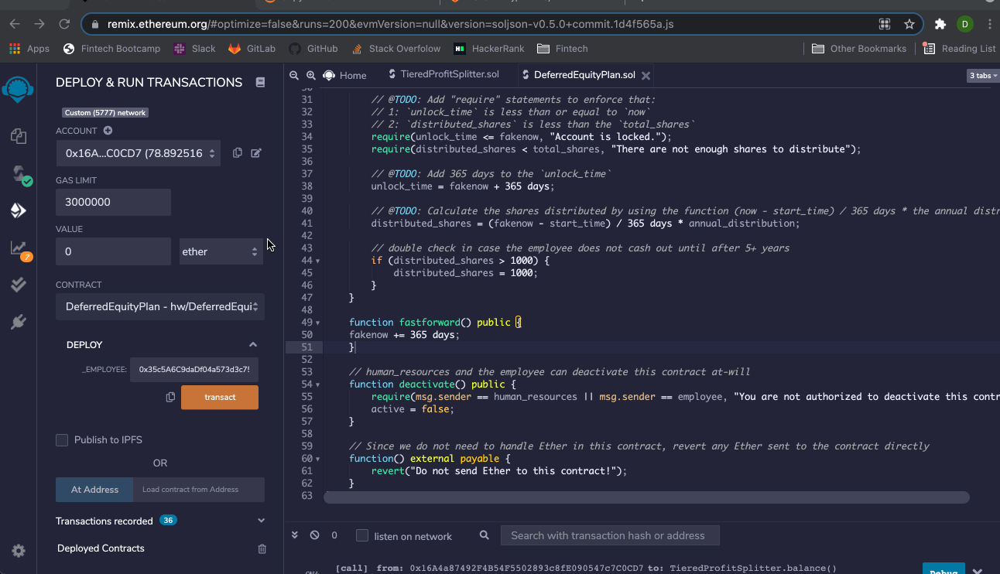

# Ethereum Smart Contracts with Solidity

The following files contain code to build smart contracts that will automate company finances to make everyone's lives easier, increase transparency, and to make accounting and auditing practically automatic.  These contracts will do several things:
- Pay your Associate-level employees quickly and easily
- Distribute profits to different tiers of employees
- Distribute company shares for employees in a "deferred equity incentive plan" automatically

---

## Technologies

Language: Solidity

Developed with [Remix](https://remix.ethereum.org/) and [MetaMask](https://metamask.io/)

---

## Instructions
*Note: Although all smart contracts have been deployed on the Kovan Test Network, for the purpose of these instructions all demostrations will be preformed on a local network with fake accounts*

### AssociateProfitSplitter
**Contract Address: 0xBE6CaE29FF671320FC572344a3548e795e63C1f7** 
The AssociateProfitSplitter contract accepts Ether into the contract and divide the Ether evenly among the associate level employees.  This will allow the Human Resources department to pay employees quickly and efficiently.

- **Balances of three employee accounts before the deposit**

- **Compile the code** 

- **Deploy the contract with Injected Web3 Environment (MetaMask) to employee accounts and make a deposit**

- **Balances of three employee accounts after the deposit of 5 Ether split evenly**

### TieredProfitSplitter
**Contract Address: 0xa5BC070a1508F6A9042976dd9f1F7d2fb8AD1dbF** 
The TieredProfitSplitter contact will distribute different percentages of incoming Ether to employees at different tiers/levels.

- **Balances of three employee accounts before the deposit**

- **Compile the code** 

- **Deploy the contract with Injected Web3 Environment (MetaMask) to employee accounts and make a deposit**

- **Balances of three employee accounts after the deposit with 60/25/15 percentage split**

### DeferredEquityPlan
**Contract Address: 0xF772638A6A14a8FaC967214a183D3b370901dF2B** 
the DeferredEquityPlan contract models traditional company stock plans.  This contract will automatically manage 1000 shares with an annual distribution of 250 over 4 years for a single employee.
*Note: we are using the fastforward function and fakenow variable for the purposes of this demonstration*

- **Compile the code** 

- **Deploy the contact with Injected Web3 Environment (MetaMask) to employee account. Distribute shares annually. Deactivate contract after 4 years when share are distributed or if no longer employed**

---

## Contributors

Drew Disbrow Marnell: dldmarnell@gmail.com

---

## License

MIT License
Copyright (c) 2021 Drew Disbrow Marnell
